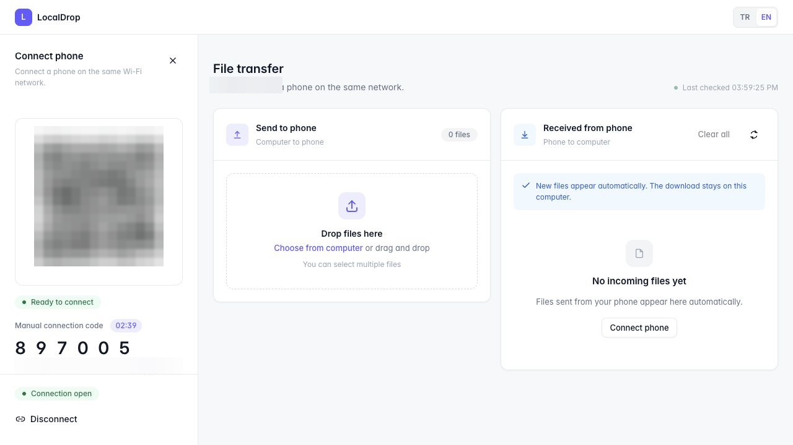
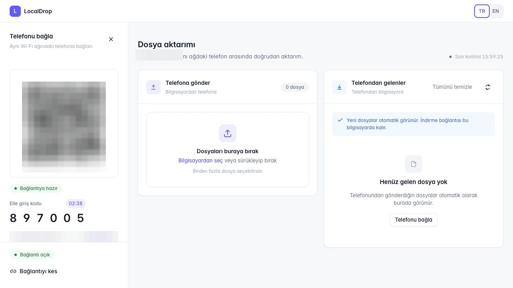
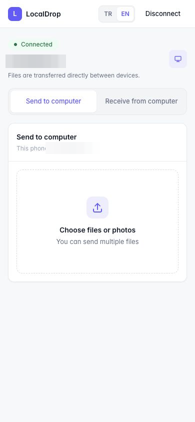
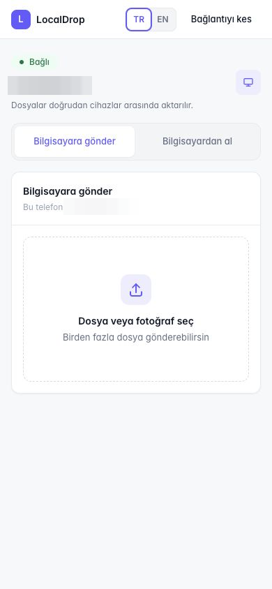

<div align="center">
  
  <h1>LocalDrop</h1>
  <p><strong>Private, two-way file transfer between a computer and phone on the same local network.</strong></p>
  <p>No cloud upload. No mobile app. No account.</p>

  [](https://github.com/mujdatsayar/LocalDrop/releases/latest)
  [](#testing)
  [](LICENSE)
</div>

<table>
  <tr>
    <th>English</th>
    <th>Türkçe</th>
  </tr>
  <tr>
    <td></td>
    <td></td>
  </tr>
  <tr>
    <td align="center"></td>
    <td align="center"></td>
  </tr>
</table>

## What is LocalDrop?

LocalDrop is a self-contained Electron and web application for transferring files directly between a computer and a phone connected to the same trusted Wi-Fi network. The phone uses its existing browser: scan the QR code shown on the desktop or enter the six-digit PIN, then send and receive files in either direction.

Files never need to leave the local network, and the interface does not rely on external fonts, icons, QR services, or cloud storage.

## Highlights

- Two-way transfer between desktop and mobile browsers
- Multiple file selection, drag and drop, progress feedback, and automatic inbox refresh
- QR-based pairing with an embedded PIN, plus manual PIN entry
- A new PIN every five minutes, with manual rotation from the desktop
- Single-phone session locking and explicit disconnect controls
- Media preview and sharing support for phone browsers
- Original filenames preserved; sending the same name again updates the stored copy
- Native desktop packaging for Windows and macOS
- Instant Turkish/English switching across desktop, pairing, and mobile screens
- Local-only assets and no cloud dependency during file transfer

## Languages

Use the single **TR / EN** control in the header to switch the complete interface instantly. The selected language is remembered on that device and remains active after a refresh or restart. The language control is available on the desktop dashboard, phone pairing screen, and connected mobile transfer screen.

All screenshots published in this repository have private IP addresses, pairing URLs, and QR codes redacted.

## Download

Ready-to-run packages are published on the [latest GitHub release](https://github.com/mujdatsayar/LocalDrop/releases/latest):

| Platform | Package | Notes |
| --- | --- | --- |
| Windows | `LocalDrop-Setup.exe` | Standard installer |
| Windows | `LocalDrop-Portable-win32-x64.zip` | Portable x64 build; no installation required |
| macOS | `LocalDrop-Setup-mac-arm64.dmg` | Apple Silicon disk image |
| macOS | `LocalDrop-Portable-mac-arm64.zip` | Portable Apple Silicon build |
| macOS | `LocalDrop-macOS-Hazir.zip` | Source-based setup bundle with helper scripts |

The current desktop builds are not signed with a commercial code-signing certificate. Windows SmartScreen or macOS Gatekeeper may therefore ask for confirmation on first launch. Only download packages from this repository.

## How it works

### Computer to phone

1. Open LocalDrop on the computer.
2. Add files to **Send to phone** by selecting or dragging them into the panel.
3. Scan the QR code with the phone, or open the displayed address and enter the PIN.
4. Download the files from the phone inbox.

After a successful phone download, a computer-to-phone item is treated as delivered and removed from both the mobile inbox and desktop outgoing list. Interrupted downloads remain available.

### Phone to computer

1. Open **Send to computer** on the phone.
2. Select one or more photos, videos, or files.
3. The files appear automatically in the desktop inbox.

Incoming and outgoing files are tracked separately so the two transfer directions never become mixed.

## Security model

LocalDrop is designed for trusted private networks:

- The server binds to the active private IPv4 address instead of all network interfaces.
- Requests are accepted only from devices on the same IPv4 subnet.
- Pairing PINs expire after five minutes.
- Repeated invalid PIN attempts from one IP address are rate-limited.
- The first correctly paired phone locks the session to that device.
- Rotating the PIN invalidates previous phone sessions.
- Host-header validation and browser security headers reduce DNS-rebinding and framing risks.
- LocalDrop does not use UPnP or configure router port forwarding.

Do not expose the LocalDrop port through router forwarding or DMZ settings. See [SECURITY.md](SECURITY.md) for responsible disclosure guidance.

## Run from source

Requirements: Node.js 20 or newer and npm.

```bash
cd uygulama
npm ci
npm start
```

For the browser-only server:

```bash
cd uygulama
npm ci
npm run start:web
```

Keep the computer and phone on the same Wi-Fi network. If a firewall prompt appears, allow LocalDrop only on trusted private networks. The server chooses an available port automatically; set the `PORT` environment variable when a fixed port is required.

## Storage locations

Packaged desktop builds store transfer data outside the application directory:

| Platform | Outgoing to phone | Incoming from phone |
| --- | --- | --- |
| Windows | `Documents\LocalDrop\files\uploads` | `Documents\LocalDrop\files\download` |
| macOS | `~/Documents/LocalDrop/files/uploads` | `~/Documents/LocalDrop/files/download` |

The source version uses `uygulama/files/uploads` and `uygulama/files/download`. Files manually placed in the uploads directory are automatically added to the phone outbox.

## Build desktop packages

### Windows

```powershell
cd uygulama
npm ci
npm run make:win
```

### macOS

The `mac/` directory is a self-contained macOS preparation bundle. Copy `mac/LocalDrop-macOS-Hazir.zip` to a Mac, extract it, and open `Kurulum.command`. The helper verifies the platform, installs dependencies, runs tests, builds the appropriate packages, installs `LocalDrop.app` in `~/Applications`, and opens it.

See [mac/README.md](mac/README.md) for complete macOS instructions.

## Project structure

```text
.
├── uygulama/                 # Primary source code and Windows build configuration
│   ├── assets/               # Application icon and installer options
│   ├── public/               # Desktop and mobile web interfaces
│   ├── scripts/              # Packaging scripts
│   └── test/                 # Node.js tests
├── mac/
│   ├── kaynak/               # Self-contained macOS source copy
│   └── kurulum/              # Locally generated macOS packages
├── kurulum/                  # Locally generated Windows packages
└── yedek/                    # Local source-backup artifacts
```

Generated dependencies, build directories, transfer data, installers, and archives are intentionally excluded from Git history. Release-ready binaries are attached to GitHub Releases so the repository remains cloneable and reproducible.

## Testing

```bash
cd uygulama
npm ci
npm test
```

The automated suite currently contains 18 tests, including localization coverage. Tests use temporary storage and do not modify the real uploads or downloads directories.

## License

LocalDrop is available under the [ISC License](LICENSE).
